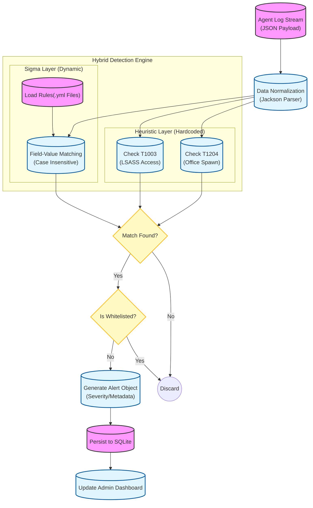

# 🛡️ LOCO - Secured Log Collector


**Loco** is a specialized cross-platform security monitoring system designed for threat hunting and incident response in hybrid environments. It combines a lightweight, embeddable Windows Agent with a powerful Linux-based Admin Dashboard to provide real-time visibility into security events.

---

## 🚀 Key Features

### 🔍 Advanced Threat Detection
Detects modern attack techniques mapped to **MITRE ATT&CK**:
*   **Behavioral Analysis**: Identifies suspicious parent-child process relationships (e.g., Office spawning PowerShell).
*   **Credential Dumping**: Monitors LSASS memory access and specific Mimikatz command lines.
*   **Persistence**: Detects new service installations, scheduled tasks, and registry backdoors (Sticky Keys).
*   **Sigma Rules Engine**: Built-in interpreter for parsing and executing industry-standard **Sigma** detection rules (YAML).

### 🔒 Security-First Architecture (DevSecOps)
Built with "Secure by Design" principles to protect sensitive log data:
*   **Encrypted Transport**: All communication between Agents and Admin is secured via **TLS/HTTPS**.
*   **Private PKI**: Agents deploy with embedded self-signed RSA-3072 certificates (`keystore.jks`), eliminating external PKI dependencies.
*   **Input Validation**: Strict whitelisting prevents Command Injection on the Agent side.

### ⚡ Smart Network Discovery
*   **Automated Scanning**: Multi-threaded scanner (100 parallel threads) automatically discovers active agents across local subnets.
*   **Zero-Config**: Agents are identified and onboarded without manual IP entry.

---

## 🛠️ Architecture

The system follows a distributed Client-Server model:



*   **Loco Admin**: JavaFX application running on Linux. Handles visualization, rule management, and network scanning.
*   **Loco Agent**: Background Windows Service (via **WinSW**) providing a secure REST API on port **9876**. specialized in collecting logs from **Application, System, Security, Sysmon, and PowerShell** channels.

---

## 💻 Tech Stack

| Component | Technology | Description |
| :--- | :--- | :--- |
| **Core** | Java 17 LTS | Primary language for performance and type safety. |
| **Admin UI** | JavaFX 17 | Modern, hardware-accelerated GUI toolkit. |
| **Agent Server** | Javalin / Jetty | Lightweight web framework for the Agent REST API. |
| **Database** | SQLite | Serverless, zero-configuration local storage. |
| **Parsing** | Jackson / SnakeYAML | JSON processing and Sigma Rule (YAML) interpretation. |
| **Security** | JSSE (SSLContext) | Custom Trust Managers for self-signed certificate handling. |
| **Packaging** | WinSW / Inno Setup | Windows Service wrapper and native .exe installer. |

---

## � Installation

### Prerequisites
*   **Java JDK 17+**
*   **Maven** 3.8+

### 1. Build the Project
Clone the repository and build both modules:
```bash
mvn clean package -DskipTests
```

### 2. Run the Admin Dashboard (Linux)
```bash
cd loco
./mvnw javafx:run
```

### 3. Deploy the Agent (Windows)

**Option A: Using Installer (Recommended)**
1.  Download `LocoAgentInstaller.exe`.
2.  Run as **Administrator**.
3.  Follow the setup wizard to install the **"Loco Agent Service"**.
4.  The agent will automatically start and runs as a background Windows Service.

**Option B: Manual / Developer Run**
*   **Run as JAR**:
    ```cmd
    java -jar loco-agent-1.0-SNAPSHOT.jar
    ```
*   **Verify Health**:
    ```bash
    curl -k https://localhost:9876/ping
    # Returns: pong|<username>|<hostname>
    ```

---

## 📊 Usage Guide

1.  **Start the Admin Dashboard**: Launch the application on your Linux workstation.
2.  **Discover Agents**: The system automatically scans local subnets on startup. Detected agents connect automatically.
3.  **Monitor Events**: Navigate to the **Analyzye** tab to see real-time alerts.
4.  **Manage Rules**: Use the **Rules Engine** to view active detection logic or import new Sigma rules.

---

## 🤝 Contributing
Contributions are welcome! Please submit a Pull Request or open an issue for bug reports.

## 📄 License
This project is licensed under the MIT License - see the [LICENSE](LICENSE) file for details.
